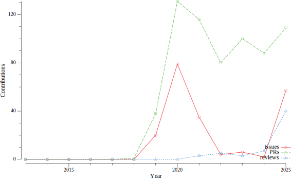

## :ninja: About Me

Hey:wave:  
I am Mitsuhiro HIBINO. In internet, I call myself `@nasustim`.

I was born in Gifu, Japan:jp:. Currently, I live in Kanagawa-ken, a suburb of Tokyo:tokyo_tower:.  
I work at [MIXI, inc](https://github.com/mixigroup) as a Software Engineer specialize in server application and infrastructure. Especially I use Go, Perl, TypeScript and AWS resources.

## Stats

## :link: More Informations

- [:man_artist: my portfolio](https://nasustim.com)  
- [:key: keybase](https://keybase.io/nasustim)

